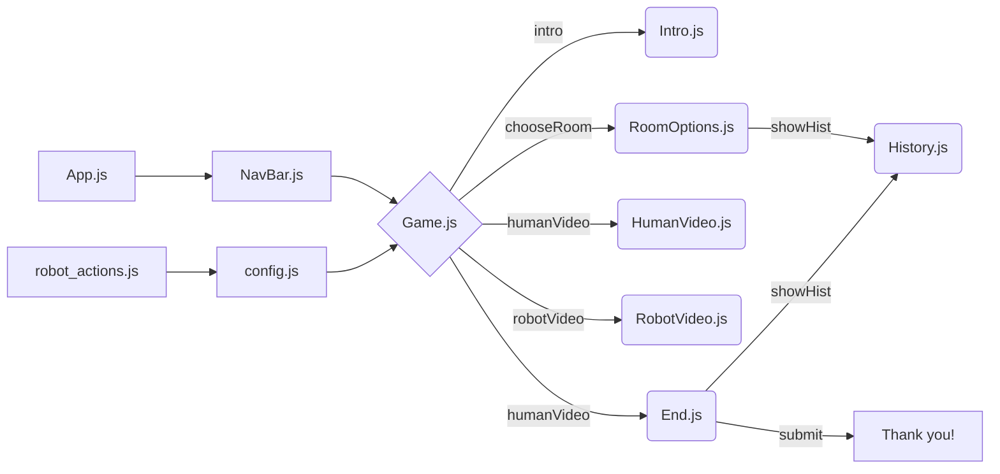
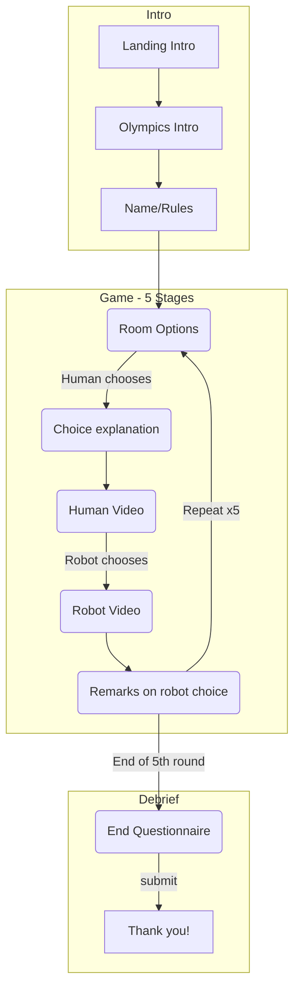

# HRI Game - Robot Olympics

Created by Matthew Tang

## Technologies used
* Frontend: ReactJS
    * Theme: Material UI
    * Deployment: Github pages
* Backend: NodeJS
    * Deployment: Heroku (https://hri-game-backend.herokuapp.com)

## Frontend

Class Heirarchy Structure:



Game Structure Flow:



## Backend
The frontend sends data to the backend to store in a google sheet using google sheets API. I used the Google-Spreadsheet Node package for this which can be found [here](https://www.npmjs.com/package/google-spreadsheet).

Data is stored in [this](https://docs.google.com/spreadsheets/d/1aVNGZKTV20RuaPTpeTE8UQ0p_gevxrxDKdD0-2HUS5U/edit#gid=0) spreadsheet.

## Backend Endpoints
Server accepts only POST requests. Do not send arrays as parameters or the backend will be unable to parse them.

### raw
Stores data progress in "raw" sheet to avoid losing partial responses.
###### Endpoint
```
https://hri-game-backend.herokuapp.com/raw
```
###### Body
- **<code>JSON</code> payload** — JSON containing data to store in spreadsheet. See example below.
- Content-Type: `application/x-www-form-urlencoded`

###### Return Format
- None

###### Example Body
```
{ 
    Name: 'Name',
    ID: 22496,
    FirstTime: true,
    Date: '7-30-2019 14:3:12',
    History: '1_2',
    TotalScore: '3.0',
    H0: 'Response here',
    R0: 'Response here',
    ...
    SiteVersion: 1.1
}
```

---

### complete
Stores data progress in "complete" sheet to avoid losing partial responses. Similar body/return as above
###### Endpoint
```
https://hri-game-backend.herokuapp.com/complete
```

###### Example Body
```
{ 
    Name: 'Name',
    ID: 22496,
    FirstTime: true,
    Date: '7-30-2019 14:3:12',
    History: '1_2',
    TotalScore: '3.0',
    H0: 'Response here',
    R0: 'Response here',
    ...
    D1: 'Debrief'
    ...
    A1: 'Slider1'
    ..
    SiteVersion: 1.1
}
```

---

### Google Sheets API
I have a google cloud service account linked to the output spreadsheet (hri-game-admin@hri-game.iam.gserviceaccount.com). Please contact me (matthewtang@berkeley.edu) if you need these credentials. Credentials must be placed in the `credentials.json` file in the root folder of the server. Credentials should never be stored on github for security concerns.

Google sheets API is free so there is no practical concern for call rate-limiting.

The backend currently runs on a Heroku server using a free web dyno using my free credits. It doesn't need to run 24/7 which means I can maintain it easily without incurring charges (it can idle when nobody is using the site since data storage calls are asynchronous).

